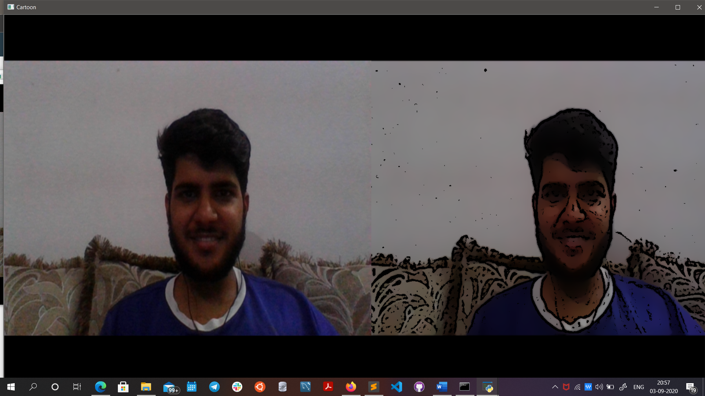
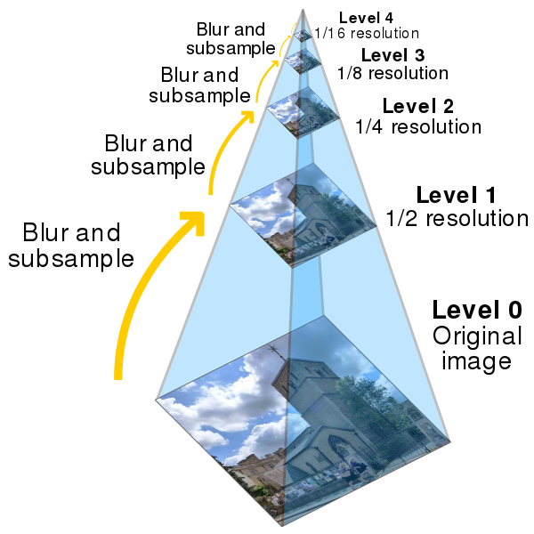
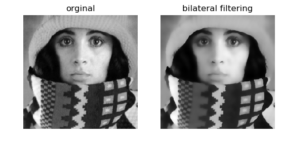

# Cartoonizer
[Cartoonizer- An application of Digital Image Processing](https://www.linkedin.com/posts/ankuraxz_computervision-imageprocessing-opensourcedevelopment-activity-6707310069723271168-g98W)
>[Download the .exe file here](https://drive.google.com/file/d/1m2fUPsGSyzCnyDBplukL1BvaBB0hbk6H/view?usp=sharing)

## Original Vs Cartoon

_Cartoonizer is an application of Digital Image processing that converts Image to Cartoon-like Image. Thanks to [Machine Learning India](https://www.linkedin.com/company/mlindia/) for motivation. The code uses Down sampling and Up sampling using Laplacian Pyramid, Bilateral Filtering, Median Blurring, Adaptive Threshold and Bitwise And._

## Involved Image Proccessing Techniques

### LAPLACIAN PYRAMID

### BILATERAL FILTER

## REFERENCES 
> https://www.wikiwand.com/en/Pyramid_(image_processing)
> https://staff.fnwi.uva.nl/r.vandenboomgaard/IPCV20172018/LectureNotes/IP/LocalOperators/bilateralfilter.html
> https://docs.opencv.org/2.4/doc/tutorials/tutorials.html

## Installing OpenCV, SKimage, Numpy, Scipy, Matplotlib for Python 3.x on Windows
